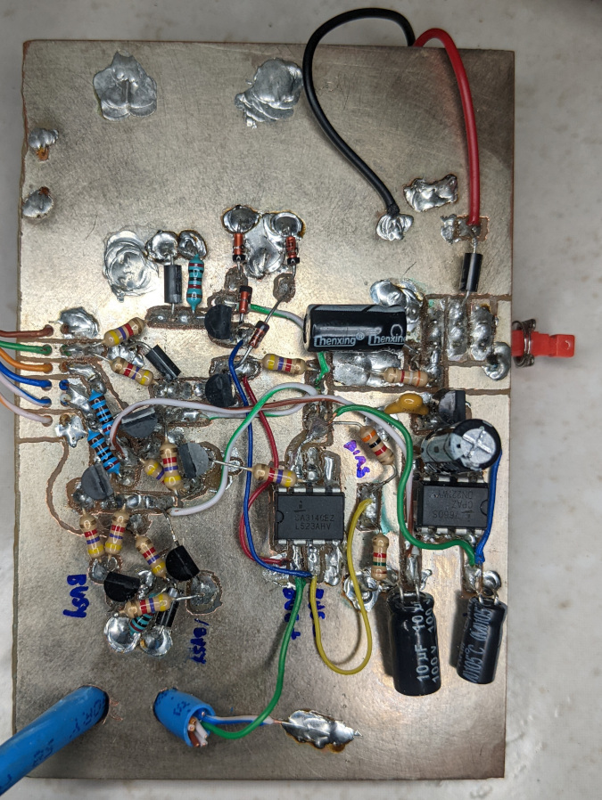
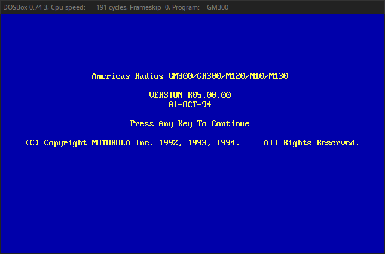
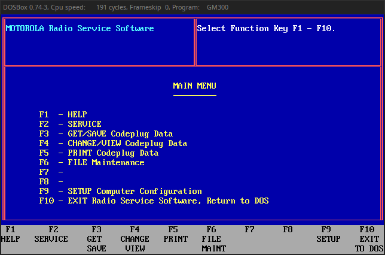
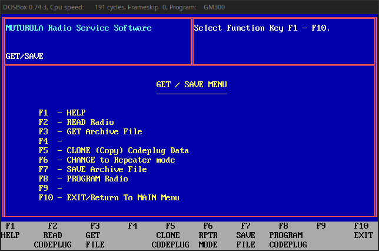
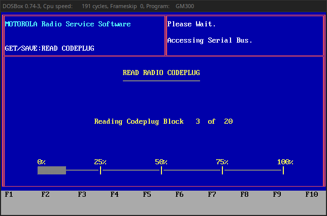
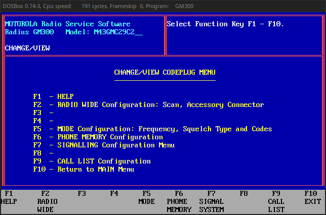
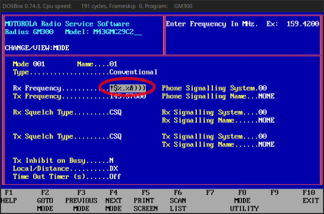
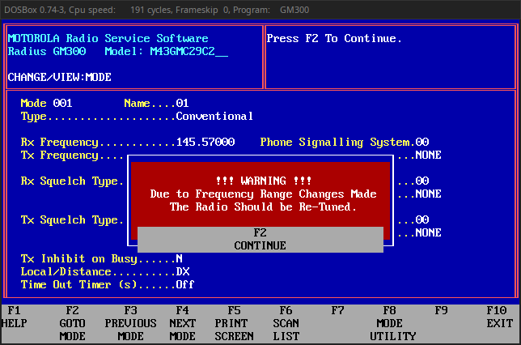
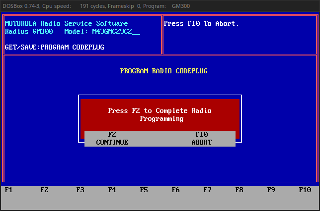
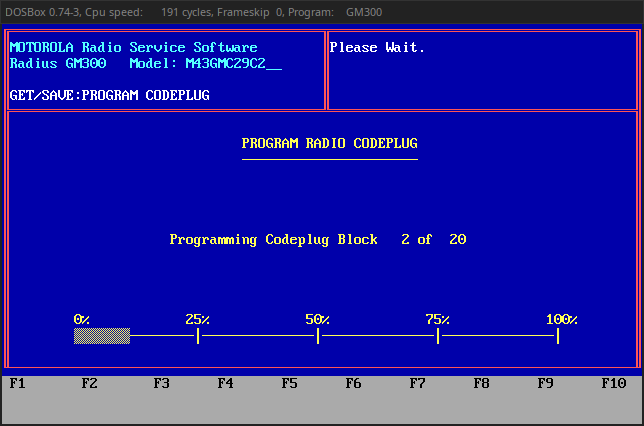

# GM300 tool in DOSBox in a container

This is the easiest way to program your Motorola Radius in Linux.

Here we have put together the work by [Jacek Ozimek](https://sourceforge.net/p/dosbox/patches/288/), [KK6JYT](https://kk6jyt.com/motorola-radius-gm300-programming/) and others in a ready-to-use container that you can just run!

## Use a RIB to connect your radio to your PC

If you don't already have a RIB, we recommend following the [schematics by VR2ZHU](http://www.hkra.org/homebrew/rib/Rib.html) to reproduce the original Motorola RLN4008B RIB.

Below is my RIB which looks like it came straight from an ugly DIY projects contest.

## Make sure your user can access /dev/ttyUSB0

Depending on your Linux distro, you might have to add yourself to the `uucp` or `dialout` groups.

If you get yourself in despair and want a quick hack, you may just `chmod 0666 /dev/ttyUSB0`.

## Run the container

Just clone this repository and call `./run.sh`.

## Follow the steps

1. Press any key.

2. Press F3 to enter the `GET/SAVE Codeplug Data` menu.

3. Press F2 to `READ Radio`.

4. Wait some instants while radio codeplug is read.

   Press F10 to go back to the `MAIN Menu`. Then, press F4 to enter the `CHANGE/VIEW Codeplug Data` menu.

5. Press F5 to go to `MODE Configuration: Frequency, Squelch Type and Codes`.

6. Change the settings as desired. Navigate using Tab and F3/F4.

   When programming ham radio frequencies, you may receive the error `Valid Range is: 146.0 to 174.0`. Override the check by pressing Shift when entering numbers. Enter the decimal point as usual (no Shift when entering `.`) and take care to fill the entire field (pad with zeros, i.e. `)`, to the right if needed). See the figure above for an example.

7. Press F2 if you receive a warning.

8. Press F10 twice to return to the `Main Menu`. Then, press F3 to enter the `GET/SAVE Codeplug Data` menu.

   Finally, press F8 to `PROGRAM Radio` and F2 to confirm.

9. Wait some instants while radio codeplug is programmed and have fun.

## Acknowledgments

Thanks to all the friends from QRM-BR!
